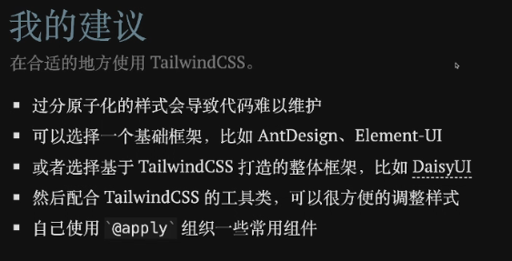

## 项目说明

- 基本环境搭建

```
使用文档：https://www.tailwindcss.cn/docs/installation
DaisyUI：https://daisyui.com/?lang=zh_cn

安装依赖
npm install -D tailwindcss postcss autoprefixer postcss-cli

初始化配置文件 tailwind.config.js
npx tailwindcss init

编译 CSS 代码
npx tailwindcss -i ./src/tailwind.css -o ./dist/output.css --watch

使用 VSCode 开发工具
建议下载【Tailwind CSS IntelliSense】插件，有提示作用
```

## 基本使用

- 我的建议



- 尺寸说明

```
w-px	    width: 1px;
w-0.5	    width: 0.125rem; /* 2px */
w-1	      width: 0.25rem;  /* 4px */
w-4	      width: 1rem;     /* 16px */
w-1/2	    width: 50%;
w-full	  width: 100%;
w-screen	width: 100vw;

总结：
```

- 自定义样式

```
背景透明：bg-transparent 或者 bg-[transparent]

/* 如高度是22px的，就可以写成,同理z-index也可以，还有各种颜色等属性也可以这样 */
.example {
  @apply h-[22px];
}
.example {
  @apply z-[-1];
}
```